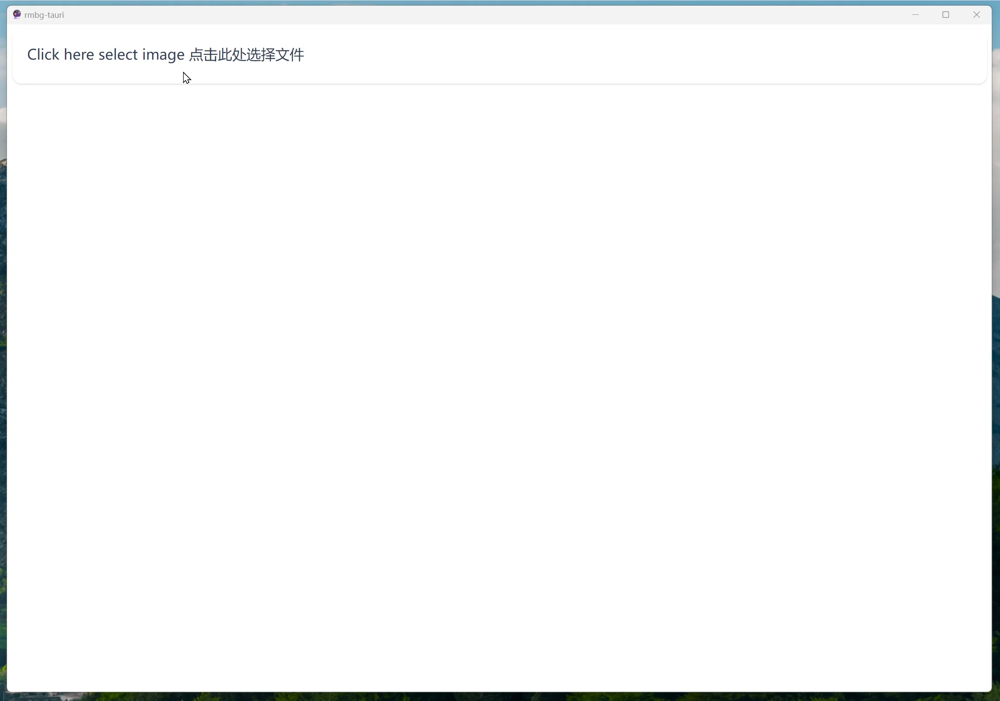

# RMBG-tauri
A simple app to remove background from image. 

用Tauri2打包的RMBG-1.4的去背景工具。



# Technology Stack 
- Tauri 2
- Vue 3
- [RMBG-1.4](https://huggingface.co/briaai/RMBG-1.4)

# RoadMap
- [X] windows demo
- [ ] linux app demo
- [ ] android app demo

# Development
```bash
mkdir -p src-tauri/resources
curl -L -o src-tauri/resources/rmbg.onnx "https://huggingface.co/briaai/RMBG-1.4/resolve/main/onnx/model.onnx?download=true"
pnpm tauri dev
```
# Acknowledgments
- [tauri-app/tauri](https://github.com/tauri-apps/tauri)
- [pekc83/rmbg](https://github.com/pekc83/rmbg): this crate shows how to use RMBG in Rust
- [RMBG-1.4](https://huggingface.co/briaai/RMBG-1.4) : background removal model
- [pykeio/ort](https://github.com/pykeio/ort) Rust ONNX Runtime